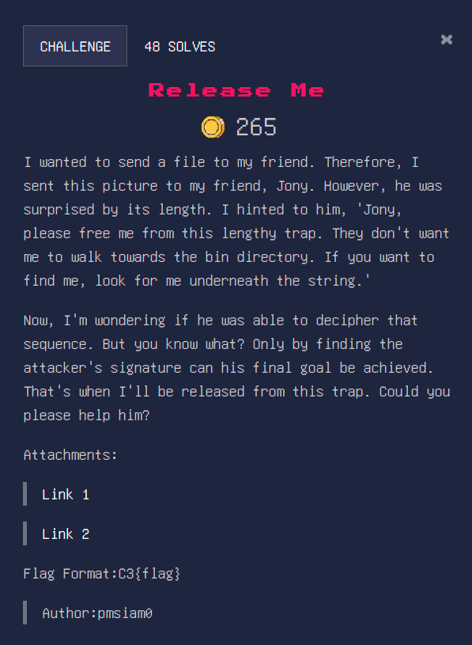

# Release Me
## Category : Forensics
## Points : 500(dynammic)
<div align="center">
    
</div>


The file size was massive(550 mb +), hinted by the line `Jony,please free me from this lengthy trap`.I downloaded the image in kali linux.

There was something about `bin directory` , but I decided to ignore it.

Then , there was the obvious hint of using strings, so I went with it.

```cmd
strings new_image.jpg > extracted_strings.txt
grep -i "C3{" extracted_strings.txt // grep for flag
```

Flag:
```
C3{Knight_Member_pmsiam0}
```
